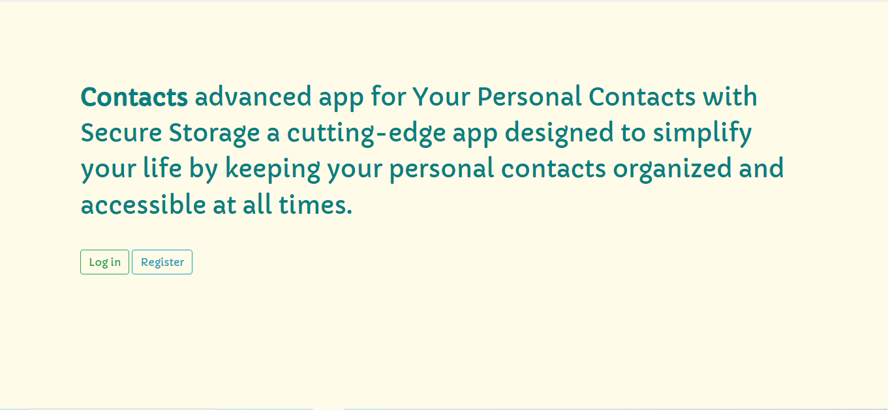
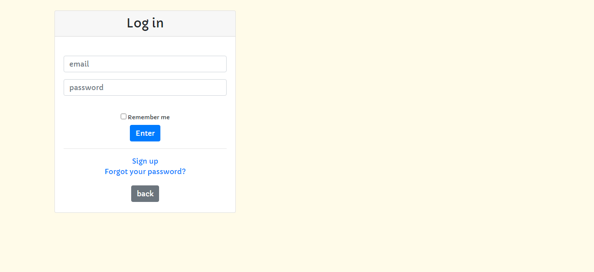
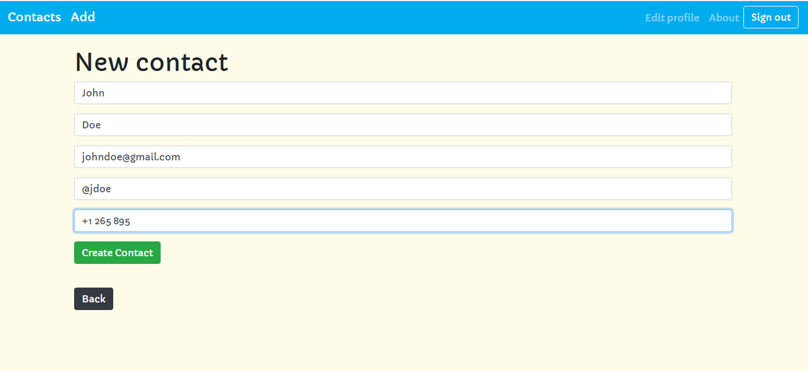
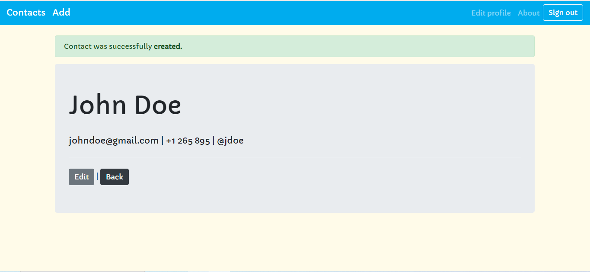

# Contacts
This is an application where you can save and manage your contacts safely

## Characteristics
This application you can create an account, once there store your contacts, add, edit and delete them. Once you have created your profile you can edit it.
In this application where different users can enter and each one will have their contacts in specific databases for each user, better protecting and managing your contacts.

## Img
|  |  |
|:---:|:---:|
| Home | Log in |
|  |  |
|:---:|:---:|
| Add new | contact |

## Technology used
-Ruby "3.1.4"
-Rails "7.0.5"
-Bootstrap "4.5"
-Database: "Postgresql"

## License
[MIT](https://choosealicense.com/licenses/mit/)